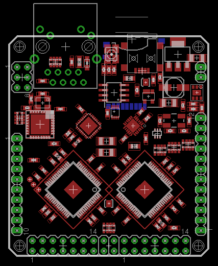

#Amino Alpha Development Board Documentation#
Alpha is the very first opensource hardware implementation and reference implementation for the Amino project. here are some key features:

1. Full Amino stack support layers 1,2 and 3 including TCP/IP
2. Built in debugging for layer 1
3. External JTAG Debugging connector for Layer 2 and 3 debug.
4. 10/100baseT Ethernet - implemented as an [HSM](../../hsm.html)
5. Full speed usb 2(480Mb/sec) connection and PHY.
6. Dedicated Serial communications UART and I2C on COMM port header
7. Multiplexed 8 Channel 10bit successive approximation ADC with buffer
8. 2 high speed XPorts offering up to 50MB/sec bandwidth each
9. 2 L1-64 Xmos XS1 cores offering a total of 16 event driven threads
10. 4Mbits of onboard SPI managed flash.
11. An optional MicroSD card for storage,sketches,applications or participant data.
12. A communications multi status RGB LED indicator

##The Amino Alpha layout

[Alpha Schematic](alpha-schematic.pdf)

