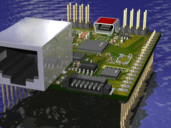
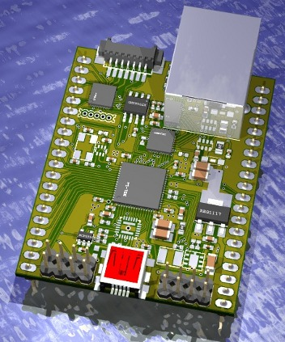

#NetStamp#

##Amino Opensource hardware reference implementation##

NetStamp is the opensource hardware reference implementation for the Amino project, it supports all of the basic features and requirements of that project. NetStamp provides the latest XMOS multicore technology in an accessible stamp form factor, using dual inline connectors. Now anyone can build Xmos multi core projects without the need of complex surface mount assembly and production, lowering the barrier to entry for co-creative organisations and individuals alike. But NetStamp brings much more to the party than a regular stamp, it includes 100/10 base T Ethernet networking which when used with the Amino TCP/IP stack allows construction of sophisticated Internet based devices. With this new generation of Net based stamps a whole new era of intelligent Internet devices can be envisaged, prototyped and produced at a fraction of the cost of previous solutions. NetStamp introduces event driven processing to an audience who were previously denied access due to the complexities of surface mount technology, the Amino project will achieve similar software benefits to that very same audience.

###Features###

1. Xmos dual core XS1 L2 multiprocessing 800-1000 MIPs of event driven processing
2. Full Amino software compatibility
3. Built in Ethernet 100/10 baseT networking incl TCP/IP
4. Full Speed 480Mbits/sec USB
5. On Board Analogue I/O up to 14bit ADCs and 9 Bit DACs
6. Special function analogue blocks including, 2 capacitive sensing pins
7. Xmos Xtag/Xtag2 programming and debugging via an adaptor
8. Channel expansion to connect other Xmos devices
9. Compact size approximately 55 x 45mm
10. 4Mbits storage for amino stack and user space
11. Optional MicroSD card socket allowing Gigabytes of data and program storage
12. Total of 43 I/O lines of which 2 are dedicated I2C and 7 provide analogue functions

###Design & Layout###

[Schematic](stamp/NetStamp.pdf)
