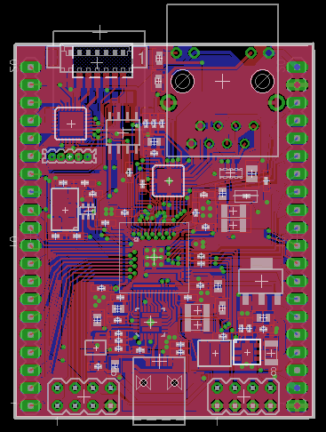

#NetStamp#

##Amino Opensource hardware reference implementation##

###Features###

1. Xmos dual core XS1 L2 multiprocessing 800-1000 MIPs of event driven processing
2. Full Amino software compatibility
3. Built in Ethernet 100/10 baseT networking incl TCP/IP
4. Full Speed 480Mbits/sec USB
5. On Board Analogue I/O up to 14bit ADCs and 9 Bit DACs
6. Special function analogue blocks including, 2 capacitive sensing pins
7. Xmos Xtag/Xtag2 programming and debugging via an adaptor
8. Channel expansion to connect other Xmos devices
9. Compact size approximately 55 x 45mm
10. 4Mbits storage for amino stack and user space
11. Optional MicroSD card socket allowing Gigabytes of data and program storage
12. Total of 43 I/O lines of which 2 are dedicated I2C and 7 provide analogue functions

###Design & Layout###

[Schematic](stamp/NetStamp.pdf)
